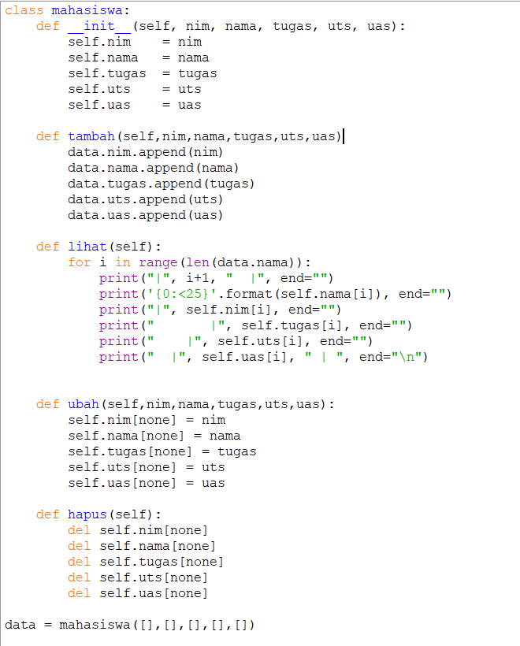
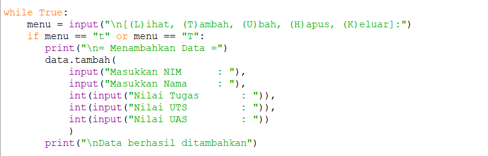
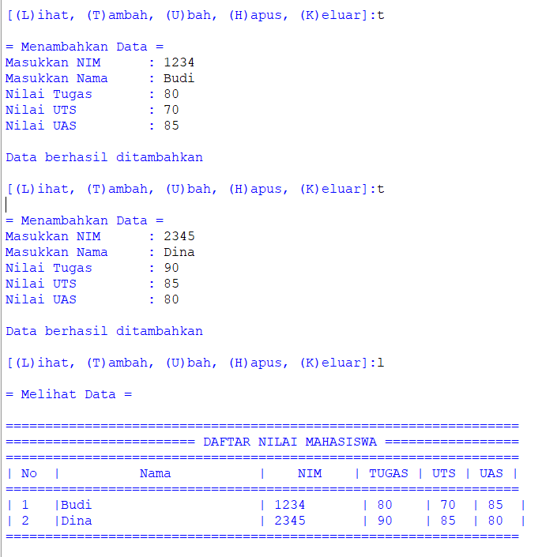
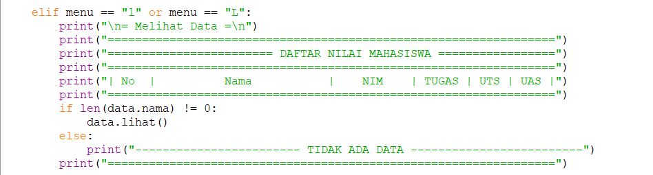
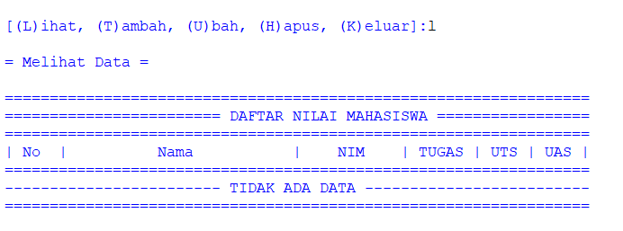
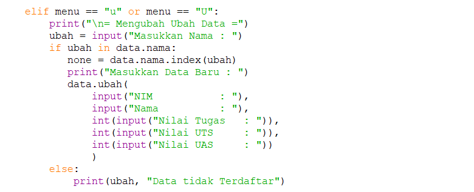
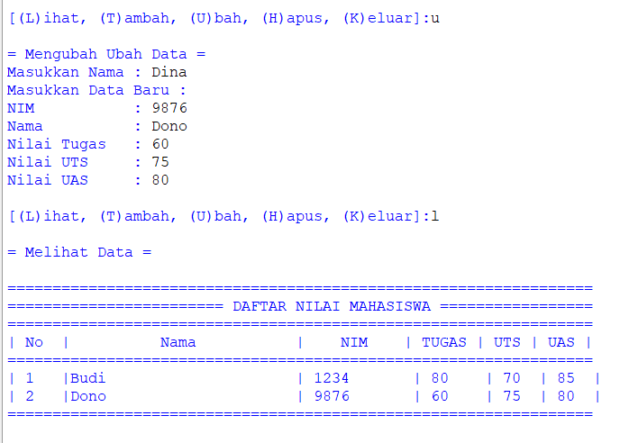
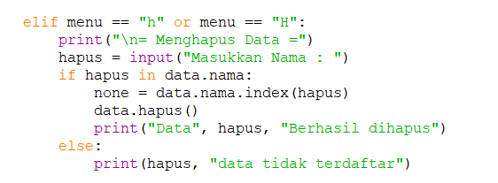
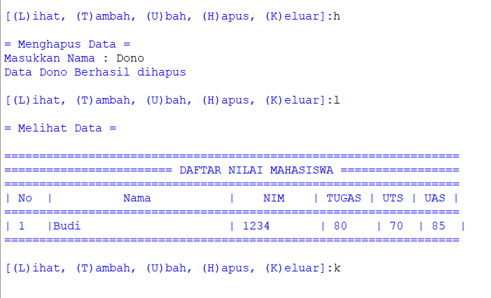

# Praktikum-7

# Membuat Daftar Nilai Mahasiswa Menggunakan Class Pada Python

Disini saya akan membuat langkah-langkah membuat program sederhana daftar nilai mahasiswa menggunakan methode class.
1. Langkah pertama kita buat constructor terlebih dahulu dan masukan nama,nim,tugas,uts,uas sebagai variable. ini merupakan fungsi yang akan kita eksekusi pada instance class yang akan kita buat.
2. Setelah membuat constructor Kita juga buat fungsi untuk menambah data, melihat data, mengubah data dan menghapus data fungsi ini juga akan kita eksekusi ketika membuat instance class.

3. Selanjutnya kita mulai ke tahap eksekusi, pertama kita buat program untuk menambahkan data. Kita perlu mengeksekusi constructor agar data yang kita buat bisa ditampilkan. Berikut Programnya :

Hasil Program :

4. Berikutnya kita buat program untuk melihat data, untuk melihat data kita perlu memanggil constructor yang telah kita buat. Berikut programnya :

Hasil Program :

5. Langkah ke-5 kita buat program untuk mengubah data yang telah kita buat, untuk mengubah data kita eksekusi constructor yang kita buat tadi dan masukan nama yang akan kita ubah. Berikut programnya :

Hasil Program :

6. Berikutnya menghapus data. Untuk menghapus data programnya hampir sama seperti mengubah data, bedanya ketika menghapus data kita tidak perlu memasukan data kembali hanya perlu memasukan data yang akan kita hapus. Berikut programnya :

Hasil Program :

